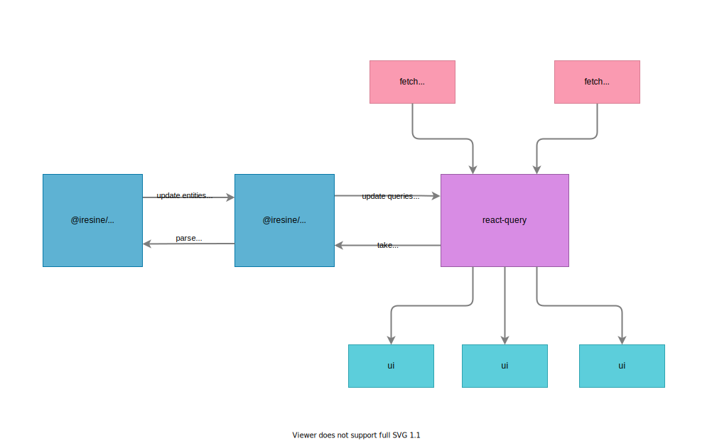

## Description of the problem:


<br/> Imagine this
sequence:

1. The client application requests a list of users with a request to /users and it gets users with id from 1 to 10
2. User with id 3 changes his name
3. The client application requests the user with id 3 using a request to /user/3

**Question:** What is the username with id 3 in the application? <br/> **Answer:**
Depends on the component that requested the data. In a component that uses
data from the request to /users, the old name will be displayed. In a component that
uses the data from the request to /user/3, the new name will be displayed.

**Conclusion**: In this case, there are several entities of the same meaning with different data sets in the system.

**Question:** Why is that bad? <br/> **Answer:** At best user
will see different names of one person in different sections of the site, at worst translate
money for old bank details.

## Solution options

Currently, there are the following solutions to this problem:
- Not to pay attention
- Normalize data with your own hand
- Use graphql client (apollo or relay)

### Not to pay attention

This is the most obvious and tempting option. In some cases, the client
the app can really afford to have the same entities with
different data. But what about when this is unacceptable behavior?
How to deal with developers who do not want to create an application with such
defects?

### Normalize data with your own hand

An example of a handwritten implementation is the code for mobx:

```js
class Store {
  users = new Map();

  async getUsers() {
    const users = await fetch(`/users`);
    users.forEach((user) => this.users.set(user.id, user));
  }

  async getUser(id) {
    const user = await fetch(`/user/${id}`);
    this.users.set(user.id, user);
  }
}
```

And if the example with mobx looks acceptable, then normalization in redux is simply
[terrifying](https://redux.js.org/recipes/structuring-reducers/normalizing-state-shape).
Working with such code becomes more difficult as it grows and completely
not interested.

### Use graphql client (apollo or relay)

Apollo and relay are libraries that can normalize data out of the box.
However, such a solution forces us to use graphql and apollo, which, according to
in my opinion, they have many disadvantages.

### Normalization

What is normalization and how does it allow graphql clients to deal with the specified
problem? Let's take a look at the apollo example! This is how apollo describes his actions with
data:

> ...**normalizes** query response objects before it saves them to its internal
> data store.

What does the specified _normalize_ include?

> Normalization involves the following steps:
>
> 1. The cache generates a unique ID for every identifiable object included in
>    the response.
> 2. The cache stores the objects by ID in a flat lookup table.

That is, apollo generates a unique identifier for each entity, for
which it is possible to form it. Apollo uses it as a key to store all entities.
This is how the formation of an identifier and its storage looks roughly:

```js
const store = new Map();

const user = {
  id: '0',
  type: 'user',
  name: 'alex',
  age: 24,
};

const id = `${user.type}:${user.id}`;

store.set(id, user);
```

The combination of type and id gives us a truly unique key. We can be
are sure that if we meet another user with the same type and id, then this
will be the same user.

## Getting a unique identifier

Apollo achieves the specified effect by querying the internal
field __typename, but how to achieve a similar effect without graphql?

Since we have no internal fields with types, we should only rely on
data fields. Here are some solutions:

- make id or similar field globally unique
- add information about entity types to data
  - add types on the server
  - add types on the client

### Make field globally unique

In this case, the storage of entities will look like this:

```js
const store = new Map();

const user = {
  id: '0',
};

const comment = {
  id: '1',
};

store.set(user.id, user);
store.set(comment.id, comment);

// ...

store.get('0'); // user
store.get('1'); // comment
```

The solution looks pretty easy to use, but implementing globally unique id fields will be difficult. 
As a rule, entities are stored in a database and have a unique id only within a collection/table (or in other words of some type).
This means that it takes a lot of effort to make the id globally unique.

### Add information about entity types to data

In this case, the storage of entities looks like this:

```js
const store = new Map();

const user = {
  id: '0',
  type: 'user', // <-- new field
};

const comment = {
  id: '1',
  type: 'comment', // <-- new field
};

function getStoreId(entity) {
  return `${entity.type}:${entity.id}`;
}

store.set(getStoreId(user), user);
store.set(getStoreId(comment), comment);

// ...

store.get('user:0'); // user
store.get('comment:1'); // comment
```

It is still convenient, but it requires us to add a special field in the data.
It seems to me that this small sacrifice pays off with the ability to automatically track changes in the data.
It was this option that I chose as preferable for myself.

### Where to add types to data?

The problem of data normalization is especially common in client applications.
Поэтому рассмотрим вопрос - в какой момент добавлять информацию о типах в данные
для клиента. Мы можем выбрать один из указанных вариантов для добавления типов.

- На сервере, при отдаче данных:

```js
app.get('/users', (req, res) => {
  const users = db.get('users');
  const typedUsers = users.map((user) => ({
    ...user,
    type: 'user',
  }));
  res.json(typedUsers);
});
```

- На клиенте, при получении данных:

```js
function getUsers() {
  const users = fetch('/users');
  const typedUsers = users.map((user) => ({
    ...user,
    type: 'user',
  }));
  return typedUsers;
}
```

Как мне кажется вариант добавления данных на сервере является предпочтительным.
Api, которое отдает данные, знает о том какие данные и какого типа отдает.
Однако в некоторых случаях нет возможности изменить код сервера для отдачи типа,
в таких случаях можно добавить типы на клиенте.

Теперь разберемся как все это автоматизировать.

## iresine

`iresine` это библиотека созданная для нормализации данных и оповещении об их
изменении.

В данный момент iresine состоит из следующих модулей:

- @iresine/core
- @iresine/react-query

Так iresine работает с react-query:



### @iresine/core

Основной модуль библиотеки, именно он отвечает за парсинг данных, их
нормализацию и оповещении подписчиков об изменении конкретной сущности.

```js
const iresine = new Iresine();
const oldRequest = {
  users: [oldUser],
  comments: {
    0: oldComment,
  },
};
// new request data have new structure, but it is OK to iresine
const newRequest = {
  users: {
    0: newUser,
  },
  comments: [newComment],
};

iresine.parse(oldRequest);
iresine.parse(newRequest);

iresine.get('user:0' /*identifier for old and new user*/) ===
  newRequest.users['0']; // true
iresine.get('comment:0' /*identifier for old and new comment*/) ===
  newRequest.comments['0']; // true
```

Как видим из идентификаторов, по которым мы получаем сущности из хранилища,
@iresine/core использует следующую схему для создания идентификаторов:

```js
entityType + ':' + entityId;
```

По умолчанию @iresine/core берет тип из поля `type`, а id из поля `id`. Это
поведение можно изменить, передав собственные функции. Например попробуем
использовать такой же идентификатор как в apollo:

```js
const iresine = new Iresine({
  getId: (entity) => entity.id,
  getType: (entity) => entity.__typename,
});
```

Так же мы можем обрабатывать и глобально уникальное поле id, применив небольшой
хак:

```js
const iresine = new Iresine({
  getId: (entity) => entity.id,
  getType: (entity) => entity.id,
});
```

А что @iresine/core делает с сущностями, где идентификатор не обнаружен?
Например такими:

```js
const user = {
  id: '0',
  type: 'user',
  jobs: [
    {
      name: 'milkman',
      salary: '1$',
    },
    {
      name: 'woodcutter',
      salary: '2$',
    },
  ],
};
```

user имеет своей идентификатор в хранилище, а как быть с jobs? У них нет ни поля
type ни поля field! @iresine/core следует простому правилу: если у сущности нет
идентификатора, то она становится частью ближайшей родительской сущности с
идентификатором.

@iresine/core являет универсальной библиотекой, которая знает о том как
распарсить данные и точечно уведомлять подписчиков. Но использовать ее напрямую
довольно нудно и утомительно! Посмотрим как сделать этот процесс удобнее.

## @iresine/react-query

react-query это прекрасная библиотека, с которой я бы посоветовал ознакомиться
каждому. Количество фич кажется запредельным: от кэширования запросов до
синхронизации данных между окнами браузера. Но в ней отсутствует нормализация
данных, и именно этот факт вдохновил меня на написание iresine.

@iresine/react-query это плагин для react-query. Он позволяет использовать
функцию нормализации и обновления данных @iresine/core на данных хранилища
react-query. Вся работа по нормализации происходит автоматически и клиент
работает с react-query так, как бы работал без iresine.

```js
import Iresine from '@iresine/core';
import IresineReactQuery from '@iresone/react-query';
import {QueryClient} from 'react-query';

const iresineStore = new IresineStore();
const queryClient = new QueryClient();
new IresineReactQueryWrapper(iresineStore, queryClient);
// now any updates in react-query store will be consumbed by @iresine/core
```

Схема взаимодействия выглядит так(была приведена выше):


## Итог

Нормализация данных на клиенте это проблема. Сейчас она решается разными
способами с разной степенью успешности. В написанном выше материале автор
предлагает свой способ решения этой проблемы. Если сократить все предложение до
нескольких слов, то они будут звучать как **_добавьте информацию о типах в
данные, а после этого используйте iresine_**
