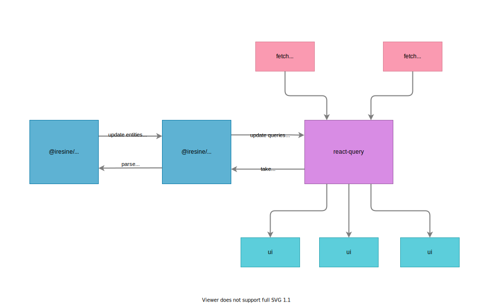

## Описание проблемы

<br/> Представим себе такую
последовательность:

1. Клиентское приложение запрашивает список пользователей запросом к /users и
   получается пользователей с id от 1 до 10
2. Пользователь с id 3 меняет свое имя
3. Клиентское приложение запрашивает пользователя с id 3 с помощью запроса к
   /user/3

**Вопрос:** Какое имя пользователя с id 3 будет в приложении? <br/>
**Ответ:** Зависит от компонента, который запросил данные. В компоненте, который использует
данные из запроса к /users, будет отображаться старое имя. В компоненте, который
использует данные из запроса к /user/3, будет отображаться новое имя.

**Вывод**: В таком случае в системе существует несколько одинаковых по смыслу
сущностей с разным набором данных.

**Вопрос:** Почему это плохо? <br/>
**Ответ:** В лучшем случае пользователь увидит разные имена одного человека в разных разделах сайта, в худшем переведет
деньги на старые банковские реквизиты.

## Варианты решения

В настоящее время существуют следующие варианты решения этой проблемы:

- Не обращать внимание
- Нормализовать данные собственноручно
- Использовать клиент graphql (apollo или relay)

### Не обращать внимание

Это самый очевидный и заманчивый вариант. В некоторых случаях клиентское
приложение действительно может позволить себе иметь одинаковые сущности с
разными данными. Но что делать со случаями, когда это недопустимое поведение?
Как быть с разработчиками, которые не хотят создавать приложение с такими
дефектами?

### Нормализовать данные собственноручно

Примером собственноручной реализации может послужить код для mobx:

```js
class Store {
  users = new Map();

  async getUsers() {
    const users = await fetch(`/users`);
    users.forEach((user) => this.users.set(user.id, user));
  }

  async getUser(id) {
    const user = await fetch(`/user/${id}`);
    this.users.set(user.id, user);
  }
}
```

И если пример с mobx выглядит приемлемо, то нормализация в redux просто
[ужасает](https://redux.js.org/recipes/structuring-reducers/normalizing-state-shape).
Работать с таким кодом становится сложнее по мере его увеличения и совсем
неинтересно

### Использовать клиент graphql (apollo или relay)

Apollo и relay это библиотеки, которые из коробки умеют нормализовать данные.
Однако такое решение заставляет нас использовать graphql и apollo, которые, по
моему мнению, имеют множество недостатков.

### Нормализация

Что такое нормализация и как она позволяет graphql клиентам бороться с указанной
проблемой? Разберемся на примере apollo! Так apollo описывает свои действия с
данными:

> ...**normalizes** query response objects before it saves them to its internal
> data store.

Что включает в себя указанное _normalize_?

> Normalization involves the following steps:
>
> 1. The cache generates a unique ID for every identifiable object included in
     >    the response.
> 2. The cache stores the objects by ID in a flat lookup table.

То есть apollo формирует уникальный идентификатор для каждой сущности, для
которой возможно его сформировать, и использует его как ключ в хранилище всех
сущностей. Вот как примерно выглядит формирование идентификатора и его хранение:

```js
const store = new Map();

const user = {
  id: '0',
  type: 'user',
  name: 'alex',
  age: 24,
};

const id = `${user.type}:${user.id}`;

store.set(id, user);
```

Комбинация типа и id дает нам по-настоящему уникальный ключ. Мы можем быть
уверены, что если встретим другого пользователя с таким же типом и id, то это
будет тот же пользователь.

## Получение уникального идентификатора

Apollo достигает указанного эффекта, запрашивая при каждом запросе внутреннее
поле \_\_typename, а как достигнуть похожего эффекта без graphql?

Поскольку мы не имеем внутренних полей с типами, то должны полагаться только на
поля данных. Вот несколько решений:

- сделать поле id или аналогичное поле глобально уникальным
- добавить информацию о типах сущности в данные
    - добавить типы на сервере
    - добавить типы на клиенте

### Сделать поле глобально уникальным

В таком случае хранение сущностей будет выглядеть вот так:

```js
const store = new Map();

const user = {
  id: '0',
};

const comment = {
  id: '1',
};

store.set(user.id, user);
store.set(comment.id, comment);

// ...

store.get('0'); // user
store.get('1'); // comment
```

Решение выглядит достаточно удобным в использовании, однако реализация глобально
уникальных полей id будет затруднительна. Как правило, сущности хранятся в базе
данных и имеют id уникальный только внутри коллекции/таблицы (или другими
словами какого-то типа). А значит, чтобы сделать id глобально уникальным, нужно
приложить много усилий.

### Добавить информацию о типах

В таком случае хранение сущностей выглядеть вот так:

```js
const store = new Map();

const user = {
  id: '0',
  type: 'user', // <-- new field
};

const comment = {
  id: '1',
  type: 'comment', // <-- new field
};

function getStoreId(entity) {
  return `${entity.type}:${entity.id}`;
}

store.set(getStoreId(user), user);
store.set(getStoreId(comment), comment);

// ...

store.get('user:0'); // user
store.get('comment:1'); // comment
```

По-прежнему удобно, но при этом требует от нас добавления особого поля в данных.
Как мне кажется эта небольшая жертва окупается возможностью автоматического
отслеживания изменения в данных. Именно этот вариант я выбрал
предпочтительным для себя.

### Где добавлять типы в данные?

Проблема нормализации данных особенно характерна для клиентских приложений.
Поэтому рассмотрим вопрос - в какой момент добавлять информацию о типах в данные
для клиента. Мы можем выбрать один из указанных вариантов для добавления типов.

- На сервере, при отдаче данных:

```js
app.get('/users', (req, res) => {
  const users = db.get('users');
  const typedUsers = users.map((user) => ({
    ...user,
    type: 'user',
  }));
  res.json(typedUsers);
});
```

- На клиенте, при получении данных:

```js
function getUsers() {
  const users = fetch('/users');
  const typedUsers = users.map((user) => ({
    ...user,
    type: 'user',
  }));
  return typedUsers;
}
```

Как мне кажется вариант добавления данных на сервере является предпочтительным.
Api, которое отдает данные, знает о том какие данные и какого типа отдает.
Однако в некоторых случаях нет возможности изменить код сервера для отдачи типа,
в таких случаях можно добавить типы на клиенте.

Теперь разберемся как все это автоматизировать.

## iresine

`iresine` это библиотека созданная для нормализации данных и оповещении об их
изменении.

В данный момент iresine состоит из следующих модулей:

- @iresine/core
- @iresine/react-query

Так iresine работает с react-query:



### @iresine/core

Основной модуль библиотеки, именно он отвечает за парсинг данных, их
нормализацию и оповещении подписчиков об изменении конкретной сущности.

```js
const iresine = new Iresine();
const oldRequest = {
  users: [oldUser],
  comments: {
    0: oldComment,
  },
};
// new request data have new structure, but it is OK to iresine
const newRequest = {
  users: {
    0: newUser,
  },
  comments: [newComment],
};

iresine.parse(oldRequest);
iresine.parse(newRequest);

iresine.get('user:0' /*identifier for old and new user*/) === newRequest.users['0']; // true
iresine.get('comment:0' /*identifier for old and new comment*/) === newRequest.comments['0']; // true
```

Как видим из идентификаторов, по которым мы получаем сущности из хранилища,
@iresine/core использует следующую схему для создания идентификаторов:

```js
entityType + ':' + entityId;
```

По умолчанию @iresine/core берет тип из поля `type`, а id из поля `id`. Это
поведение можно изменить, передав собственные функции. Например попробуем использовать такой же идентификатор как в apollo:

```js
const iresine = new Iresine({
  getId: (entity) => entity.id,
  getType: (entity) => entity.__typename,
});
```

Так же мы можем обрабатывать и глобально уникальное поле id, применив небольшой
хак:

```js
const iresine = new Iresine({
  getId: (entity) => entity.id,
  getType: (entity) => entity.id,
});
```

А что @iresine/core делает с сущностями, где идентификатор не обнаружен?
Например такими:

```js
const user = {
  id: '0',
  type: 'user',
  jobs: [
    {
      name: 'milkman',
      salary: '1$',
    },
    {
      name: 'woodcutter',
      salary: '2$',
    },
  ],
};
```

user имеет своей идентификатор в хранилище, а как быть с jobs? У них нет ни поля
type ни поля field! @iresine/core следует простому правилу: если у сущности нет
идентификатора, то она становится частью ближайшей родительской сущности с
идентификатором.

@iresine/core являет универсальной библиотекой, которая знает о том как
распарсить данные и точечно уведомлять подписчиков. Но использовать ее напрямую
довольно нудно и утомительно! Посмотрим как сделать этот процесс удобнее.

## @iresine/react-query

react-query это прекрасная библиотека, с которой я бы посоветовал ознакомиться каждому. Количество фич кажется запредельным: от кэширования запросов до
синхронизации данных между окнами браузера. Но в ней отсутствует нормализация
данных, и именно этот факт вдохновил меня на написание iresine.

@iresine/react-query это плагин для react-query. Он позволяет использовать
функцию нормализации и обновления данных @iresine/core на данных хранилища
react-query. Вся работа по нормализации происходит автоматически и клиент
работает с react-query так, как бы работал без iresine.

```js
import Iresine from '@iresine/core';
import IresineReactQuery from '@iresone/react-query';
import {QueryClient} from 'react-query';

const iresineStore = new IresineStore();
const queryClient = new QueryClient();
new IresineReactQueryWrapper(iresineStore, queryClient);
// now any updates in react-query store will be consumbed by @iresine/core
```

Схема взаимодействия выглядит так(была приведена выше):


## Итог

Нормализация данных на клиенте это проблема. Сейчас она решается разными
способами с разной степенью успешности. В написанном выше материале автор
предлагает свой способ решения этой проблемы. Если сократить все предложение до
нескольких слов, то они будут звучать как **_добавьте информацию о типах в
данные, а после этого используйте iresine_**
